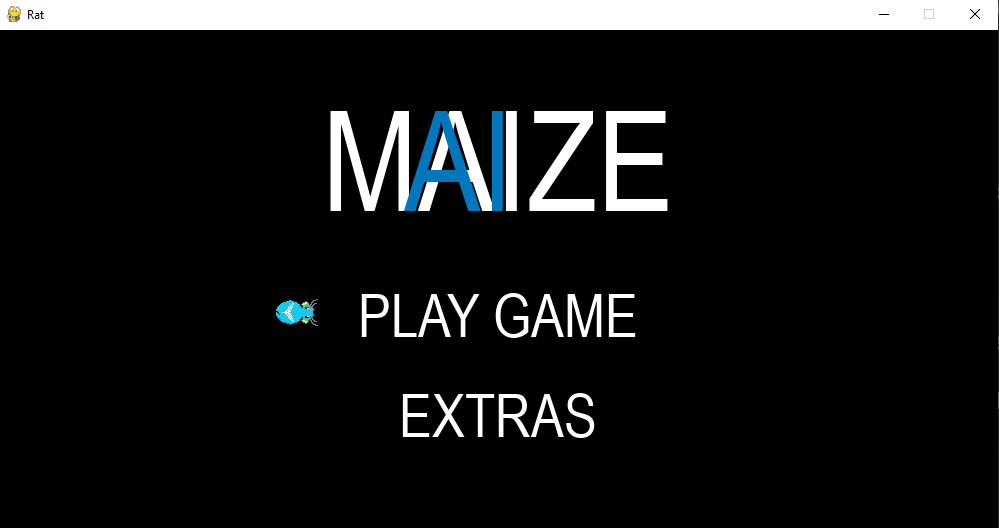
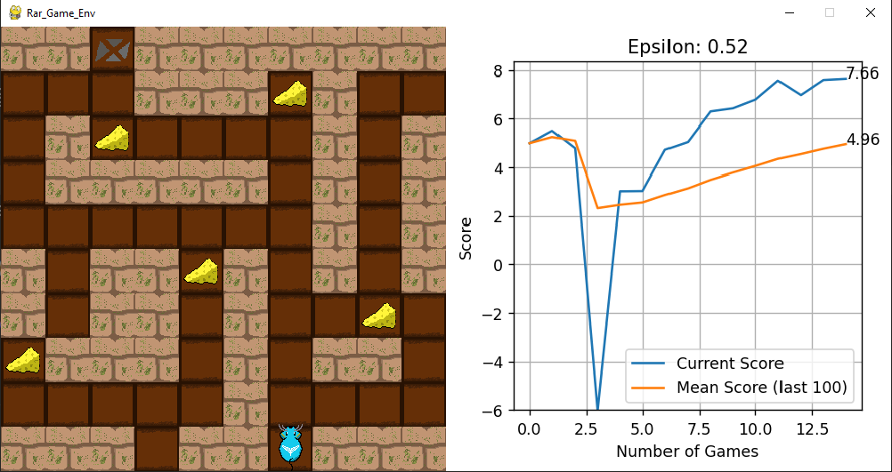

# MazeIA

## Introduction

Using reinforcement learning on a path-find problem

The project, carried out at TAIL - Technology and Artificial Intelligence League, was created by the reinforcement learning team, which had as members: Guilherme Jácome Cavalcante (leader), Humberto Navarro (director), Mauro Coimbra, Moisés Coutinho, Adriel Cabral, Caio C. and Ícaro Rodrigues.

In this project, we learned many concepts about reinforcement learning, dynamic programming, Q-learning models, and much more.

The project consists of a game (also created by us), in which a mouse (agent) inside a maze (environment) must find the optimal solution for its score (find the maximum cheese and the exit in the fewest moves) based on their states (position, forward view and the number of cheeses). There are two different game modes, maze-maker, and player vs AI; in the first mode, the user creates the map the agent will play on, and then after a few seconds of fine-tuning our model on the map, the agent shows the solution found. In the second mode, the user competes with the AI ​​to see who finishes with the least amount of moves.

## Images




## How to play:

1. Clone the repo
   ```sh
   git clone https://github.com/TailUFPB/mAIze.git
   ```
2. Install packages
   ```sh
   pip install requirements.txt
   ```
3. Run the game file (Windows)
   ```sh
   python player_game\env\game.py
   ```
   (Linux)
   ```sh
   python player_game/env/game.py
   ```
